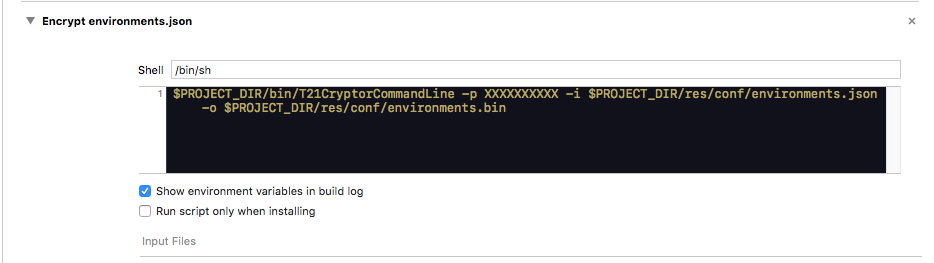

#T21Environment

This class provides helper methods to deal with app deployment related stuff, such as **build configuration dependent variables** and also, **language runtime** management support.

iOS manages natively the app language but this class offers the possibility of changing the language inside an app (in runtime), setting a different language than the current one in the OS. It is known this shouldn't be the standard approach, but we found some clients with this requirements.
 
## Version 1.0.0

### Configuring your project

To load your build-configuration dependent variables, you need to add in the **project info.plist** the next entry:

* `Configuration` : `${CONFIGURATION}` *(string type)*

With this new row, the T21Environment class will be able to retreive the current build configuration used when compiling the app.

### Loading the environment info

In order to add new build configuration dependent variables or new supported languages a `Dictionary<String,Any>` is used to provide the needed info.

The required format is this one:

* Root object
	* "languages" *(array)* 
		* es (string)
		* ca (string)
		* en (string)
		* ...
	* "configurations" *(dictionary)*
		* "Release" *(dictionary)*
			* Environment variable name 1 (var : value)
			* Environment variable name 2 (var : value)
		* "Debug" *(dictionary)*
			* Environment variable name 1 (var : value)
			* Environment variable name 2 (var : value)
		* ...

The language is specified using: *Using: ISO 639-1: two-letter codes*.

### JSON format

An easy way to configure the environments is using a JSON file which follows the required format `environments.json`:

```
{
    "languages": ["en","es","ca"],
    "configurations": {
        "appstore" : {
            "base_url" : "www.app.com/appstore"
        },
        "Debug" : {
            "base_url" : "www.app.com/devel"
        },
        "pro" : {
            "base_url" : "www.app.com/pro"
        },
        "test" : {
            "base_url" : "www.app.com/test"
        },
        "Release" : {
            "base_url" : "www.app.com/uat"
        }
    }
}
```

The previous example is using 3 different languages:

* English (en)
* Spanish (es)
* Catalan (ca)

And the `base_url` variable which changes depending of the build configuration.

### Usage

#### Init T21Environment class

First we need to create the `T21Environment` class. The constructor receives a Dictionary<String,Any> in this case loaded from the `environments.json` file.

```
let environmentsFilePath = Bundle.main.path(forResource: "environments", ofType: "json")

if let path = environmentsFilePath {
	let url = URL(fileURLWithPath: path)
	do {
		let jsonData = try Data(contentsOf: url)
		let j = try JSONSerialization.jsonObject(with: jsonData, options: [])
        if let json = j as? Dictionary<String,Any> {
            environment = T21Environment(json)
        } else {
        	  //manage error
        }
    } catch {
	    //manage error
    }
}

```

#### Query an environment related variable

Let's assume we are using the previous json file. To get the `base_url` value it's as simple as this.

```
let baseURL: String? = environment.configuration()["base_url"] as? String
```

Of course you can omit the optional stuff or create a Facade class, up to you.

```
let baseURL = environment.configuration()["base_url"] as! String
```

#### Managing languages

When the T21Environment class is initialized it fetches the preferred language of the device and tries to use it, if it's available (it checks againts the array of languages). If everything is properly configured, using a language is as simple as:

```
//assume our iOS Device is using spanish language.

var helloString = environment.localizedString("hello") // helloString -> "Hola"

environment.setAppLanguage("en") //switch to english language

helloString = environment.localizedString("hello") // helloString -> "Hello"

```

The language is automatically stored, so next time app starts will use the previous language used.

To provide string localizations, `strings` files must be created and added as target bundle resources. In the previous example case we would need 2 files:

**EN.strings**

```
"hello" = "Hello";
"good_morning" = "Good morning!"
"goodbye" = "Goodbye"
```

**ES.strings**

```
"hello" = "Hola";
"good_morning" = "Buenos días!"
"goodbye" = "Adiós"
```

#### Language changed notifications

Clients can subscribe to language change notifications. Very useful when updating the UI according the new language received.

```
public protocol T21EnvironmentNotifications : class {
    func languageUpdated( _ language: String)
}

public func addEnvironmentObserver( _ observer: T21EnvironmentNotifications)
public func removeEnvironmentObserver( _ observer: T21EnvironmentNotifications)

```

The observers are stored as **weak references**, so there is **no need to unsubscribe** them when deallocating.

### Useful hints

#### Global instance

The T21Environment class is not a singleton class. In order to offer an easy way to access the environment instance from any class, you can create a singleton class or an static var which holds the T21Environment instance.

#### Encrypting and Decrypting the environments.json file

Security must be taken in account on every app, encrypting the environments.json is an easy way to ensure the app related environment info is not available "for free" to anyone who inspects the app contents. A possible solution is to use a third party library to encrypt the json file during the build phase, and then decrypt it during the app runtime.

In some private projects we have used the following: [RNCryptor](https://github.com/RNCryptor/RNCryptor). We have created a **simple command line executable** which uses **RNCryptor** library so we can use it from an XCode build phase (executing a shell script). Then in the code the generated environments.bin file is descrypted and used. The executable program project is not part of this library.



The previous image shows the password used *XXXXXXXXXX*, the input file *environments.json* and the output file *environments.bin*.

In the code then, we have:

```
let path = Bundle.main.path(forResource: "environments", ofType: "bin")!
let url = URL(fileURLWithPath: path)
let data = try Data(contentsOf: url)
let decryptor = RNCryptor.DecryptorV3(password: "XXXXXXXXXX")
let jsonData = try decryptor.decrypt(data: data)
let json = try JSONSerialization.jsonObject(with: jsonData, options: [])
```